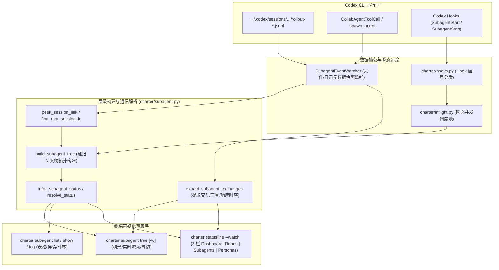

# Codex CLI Subagent 可视化增强调研与架构设计文档

---

## 1. 仓库与分支信息 (Git & Repository Metadata)

| 属性 | 信息 |
| :--- | :--- |
| **GitHub 仓库** | `CartmanFatass/charter` |
| **远程地址** | `https://github.com/CartmanFatass/charter.git` |
| **当前分支** | `main` (已同步 `origin/main`) |
| **当前状态** | Working tree clean (无未提交变更) |
| **关键关联提交** | • `fa43dbd` *feat(dashboard): integrate Subagents panel into main statusline dashboard (Scheme A+B)*<br>• `c73ca57` *feat(subagent): extend subagent tree UI, directional flow animation, and event-triggered refresh* |

---

## 2. 架构背景与全景设计 (Architectural Overview)

### 2.1 为什么需要为 Codex CLI 增强 Subagent 可视化？
Codex CLI（基于 `0.147.0+` 规范）原生缺乏富状态栏插槽（不同于 Claude Code 的 `statusLine` 配置）。在执行 multi-agent、协作派发（Collab Threads / Dispatches）时，子 Agent 的产生、流转与工具调用均在后台日志中静默进行，终端缺少直观的拓扑视图、实时进度感知与通信时序。

Charter 采用 **“零侵入日志解析 + Hook 信号拦截 + 增量事件监听 + 毫秒级 ANSI 渲染”** 架构，无需修改 Codex 二进制，即可在终端独立或集成全局看板提供实时的 Subagent 可视化。

### 2.2 整体架构数据流



---

## 3. 核心文件与模块职责清单 (File Inventory & Responsibilities)

| 核心文件 | 模块定位 | 关键符号 / 类 / 函数 | 核心职责与设计要点 |
| :--- | :--- | :--- | :--- |
| **`charter/subagent.py`** | **Subagent 核心引擎与渲染器** *(最核心)* | • 数据模型: `SubagentTree`, `SubagentTreeNode`, `SubagentExchange`, `SubagentInfo`<br>• 解析与构建: `build_subagent_tree()`, `extract_subagent_exchanges()`, `peek_session_link()`<br>• 渲染动效: `render_directory_tree()`, `render_branch_connector()`, `render_chip()`<br>• 监听机制: `SubagentEventWatcher`, `watch_subagent_tree()` | 1. 递归扫描并解析 Codex 本地 Rollout JSONL 文件；<br>2. 追溯 Parent-Child 关系构建 Multi-level 树；<br>3. 提取收发时序、耗时及工具调用（Tool Calls）；<br>4. 渲染分支流行动画（`├▸`, `├◄`, `├⚙`）、通信气泡与时间衰减；<br>5. 提供低开销的文件快照监听与平滑双缓冲刷新。 |
| **`charter/commands_subagent.py`** | **CLI 命令组入口** | • `cmd_subagent_tree()`<br>• `cmd_subagent_list()`<br>• `cmd_subagent_show()`<br>• `cmd_subagent_log()`<br>• `_resolve_session_root()` | 暴露面向用户的命令行操作：<br>• `charter subagent tree [-w]`: 树形拓扑与实时 Watch；<br>• `charter subagent list [--all]`: 表格化节点列表；<br>• `charter subagent show <id>`: 单个 Agent 详情与历史；<br>• `charter subagent log`: 交互消息时序图。 |
| **`charter/statusline.py`** | **全局状态栏与多栏看板** | • `_subagent_section()`<br>• `_3columns()`<br>• `render()` (宽屏 Scheme B 与标准 Scheme A)<br>• `watch()` | 将 Subagent 树集成至全局控制平面状态看板：<br>• 宽屏（`>= 116` 列）自动激活 **Scheme B**（`repos \| subagents \| personas` 三栏并排）；<br>• 窄屏自动退化为分段式规整布局。 |
| **`charter/inflight.py`** | **瞬态并发分发跟踪器** | • `live()`, `live_records()`<br>• `start()`, `finish()`<br>• `TTL_SECONDS = 1800` | 追踪刚刚派发、尚未在 Rollout 日志中落盘的活跃 Subagent，防止瞬态盲区，并将正在执行的 Agent 实时注入 Subagent 树。 |
| **`charter/hooks.py`** | **Hook 协议适配层** | • `subagentstart()`<br>• `subagentstop()`<br>• `pretooluse_dispatch()`<br>• `posttooluse_dispatch()` | 对接 Codex 的 Hook 触发契约（`SubagentStart`, `SubagentStop`），驱动瞬态状态更新并记录跟踪事件。 |
| **`charter/harness/codex.py`** | **Codex Harness 适配器** | • `CodexHarness`<br>• `config_path()`, `install()`<br>• `HOOK_ENTRY_KEYS = ("type", "command")` | 维护 Codex 特异性配置路径（`~/.codex/config.toml`、`$CODEX_HOME`）及功能缺陷声明（Deficits），确保环境感知准确。 |
| **`charter/tui.py`** | **轻量终端布局套件** | • `Columns`, `Stack`, `Text`<br>• `width()`, `truncate()`, `strip_ansi()` | 纯标准库实现的 ANSI 安全终端布局引擎。确保东亚宽字符计算准确、无换行错位、无残留光标。 |
| **`charter/cli.py`** | **参数总线** | • `_add_subagent_parser()` | 注册 `charter subagent` 及其子命令与参数。 |
| **`tests/test_subagent.py`** | **完整单测套件** | • 24 个独立单元测试方法 | 包含完整的 Mock Rollout 生成逻辑、时序事件模拟与断言验证，是后续重构与设计的参考规范。 |

---

## 4. 关键技术细节与协议规范 (Technical Specs & Data Contracts)

### 4.1 Codex Rollout 日志解析规范
Codex 在 `$CODEX_HOME/sessions/YYYY/MM/DD/rollout-*.jsonl` 中记录会话，Charter 通过正则 `_ROLLOUT_FILE_RE` 进行高效筛选与解析：

1. **会话元数据首行 (`session_meta`)**：
   ```json
   {
     "type": "session_meta",
     "payload": {
       "id": "019bc10d-c89d-7352-935c-76b351384357",
       "parent_thread_id": "019bc10d-0000-0000-0000-000000000001",
       "agent_nickname": "Gauss",
       "source": {
         "subagent": {
           "thread_spawn": {
             "parent_thread_id": "019bc10d-0000-0000-0000-000000000001",
             "agent_nickname": "Gauss"
           }
         }
       },
       "timestamp": "2026-08-19T10:00:00Z",
       "cwd": "/path/to/workspace"
     }
   }
   ```
   * *解析逻辑*：通过 `peek_session_link()` 提取当前 ID、父 ID 及别名，并使用 `find_root_session_id()` 沿指针向上追溯至主会话根节点。

2. **协同工具事件 (`CollabAgentToolCall`)**：
   ```json
   {
     "type": "event_msg",
     "payload": {
       "type": "item_completed",
       "item": {
         "type": "CollabAgentToolCall",
         "tool": "spawn_agent",
         "receiver_agents": [
           {"thread_id": "child-1", "agent_nickname": "Scout"}
         ],
         "agents_states": {
           "child-1": {"running": true}
         },
         "model": "gpt-5-turbo"
       }
     }
   }
   ```

3. **消息与工具时序事件 (`Exchanges`)**：
   * `user_message`: 父级向子级下发的任务 Prompt。
   * `agent_message`: 子级向父级回传的过程信息。
   * `task_complete`: 任务结束事件，携带最终消息与耗时（`duration_ms`）。
   * `function_call` / `custom_tool_call`: 子级调用的具体工具及入参。

### 4.2 动效状态机与视觉语言 (Visual Design System)
* **动态流向帧（严格 3 字符宽）**：
  * **下行派发 (Parent ➔ Subagent)**: `BRANCH_FLOW_DOWN_FRAMES = ["├▸ ", "├► ", "├➔ ", "├▼ "]`（青色）
  * **上行汇报 (Subagent ➔ Parent)**: `BRANCH_FLOW_UP_FRAMES = ["├◂ ", "├◄ ", "├◀ ", "├▲ "]`（绿色）
  * **工具执行中 (Tool Execution)**: `BRANCH_FLOW_TOOL_FRAMES = ["├⚙ ", "├⚡ ", "├⚙ ", "├⚡ "]`（黄色）
  * **节点间通信 (Peer-to-Peer)**: `BRANCH_FLOW_PEER_FRAMES = ["├➔ ", "├⇄ ", "├➔ ", "├⇄ "]`
* **时间窗口衰减 (Fading Windows)**：
  * `t <= 3.5s` (`COMM_BLAZING_WINDOW_SECONDS`): 触发高频旋转与 `⚡` 动态流动。
  * `3.5s < t <= 15.0s` (`COMM_ACTIVE_WINDOW_SECONDS`): 显示通信气泡与静态流向标签。
  * `t > 15.0s`: 恢复静态树状线条 `├── ` / `└── `。

---

## 5. 后续模型设计拓展方向 (Follow-up Design Vectors)

后续接手的模型可重点在以下 5 个方向进行深度设计与增强：

1. **Token 与成本消耗面板 (Token & Cost Breakdown)**：
   * 在 `SubagentTreeNode` 中增加 `input_tokens`, `output_tokens`, `cache_read_tokens`, `estimated_cost_usd` 字段。
   * 在 CLI 的 `tree -v` 和 `show` 中展示按 Agent 拆分的消耗排行条形图。
2. **键盘交互式 TUI (Interactive Terminal Navigation)**：
   * 将当前轮询式的 `watch_subagent_tree` 升级为具备键盘事件监听的 TUI（`j`/`k` 导航、`Enter` 展开子任务详情、`Space` 过滤活跃节点、`Tab` 切换时序与拓扑）。
3. **并发任务泳道 / 甘特图 (Concurrency DAG & Gantt Timeline)**：
   * 针对多 Agent 协同任务，在 `charter subagent log` 中输出 ASCII 形式的并发时序泳道图，直观展现关键路径（Critical Path）与等待时延。
4. **异常与重试流诊断 (Error / Retry Cascade Analysis)**：
   * 细化 `infer_subagent_status`，支持崩溃原因提取（OOM、Tool Call Error、Timeout）、父级重试重派发关系标记。
5. **跨 Harness 协议统一 (Unified Cross-Harness Protocol)**：
   * 抽象出通用的 `SubagentAdapter` 协议，使当前针对 Codex 的树构建和时序提取引擎平滑复用至 OpenCode 与 Claude Code 复杂子代理场景。
